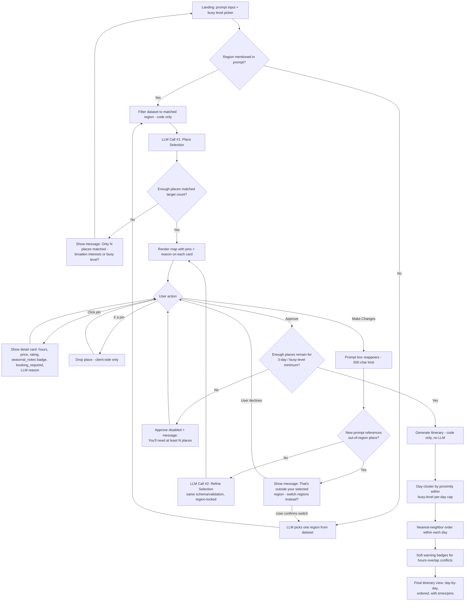

# Trip Planner — User Flow (v1)

**Stack:** React (Vite) frontend + FastAPI (Python) backend
**Trip length:** Fixed at 3 days (not user-configurable)
**Prompt limit:** 500 characters, enforced on frontend and backend

---

## Flow Diagram

---

## Step-by-Step Breakdown

### 1. Landing / Prompt Input
- Free-text box: trip vibes, interests, place types (e.g. *"relaxing coastal trip, love local food, into wine and quiet towns, not really a museum person"*)
- **500 character limit**, enforced with a live counter (e.g. `342/500`); submit disabled past the limit
- Busy-level picker (single select):
  | Level | Places/day | Total (3 days) |
  |---|---|---|
  | Chill | 2-3 | 6-9 |
  | Busy | 4-5 | 12-15 |
  | Packed | 6+ | 18+ |
- Trip length is fixed at 3 days — not shown as a user input

### 2. Region Resolution (pre-LLM, code-only)
- Backend checks prompt text against known cities/regions in `italy.json`
- Match found → filter dataset to that region immediately, no LLM call
- No match (pure vibe text) → LLM's first job is picking one region from the distinct regions present in the data
- Either path: region is **locked in code** before place selection runs — never enforced by prompt instruction alone

### 3. Place Selection — LLM Call #1
- Input: filtered subset (id, name, type, tags, description, rating, price_range) + user prompt + target place count
- Output: structured `{id, reason}` pairs (schema/tool-calling enforced)
- Backend validates every returned `id` exists in the filtered dataset before rendering anything
- **Narrow-match handling:** if matched places fall short of the target count, don't force a bad selection — show *"Only 8 places matched — want to broaden your interests or busy level?"* and return the user to the prompt input

### 4. Map Render
- Pins placed at each selected place's lat/long
- Click a pin → detail card showing: description, hours, price, rating, `seasonal_notes` as a warning badge (if present), `booking_required` flag (if true), and the **LLM's `reason`** for the pick

### 5. Review / Edit Loop
- **X a pin** → drop it from the working set (client-side state only, no LLM call)
- **Make Changes** → prompt box reappears (same 500-char limit) → new prompt text + current place ID list + region-lock context sent to backend
  - **Out-of-region check:** if the new prompt references a place/area outside the locked region, don't silently drop it — show *"That's outside your selected region (Tuscany) — want to switch regions instead?"* Confirming switches regions and restarts selection from Step 2 with the new region.
  - Otherwise → **LLM Call #2** (same schema, same ID validation), region-lock passed as an explicit hard instruction, not implied context
- Loop as many times as needed

### 6. Approve → Itinerary Generation (code-only, no LLM)
- **Minimum-count gate:** if the remaining places can't fill 3 days at the chosen busy level, Approve is disabled with a message like *"You'll need at least 18 places for a 3-day Packed trip — add more before approving."*
- Day-clustering by proximity, respecting the busy-level per-day place cap
- Nearest-neighbor ordering within each day
- Soft warning badges for hours-overlap conflicts between neighboring places (no hard rejection)
- Final view: day-by-day itinerary, ordered, with times/pins

---

## Locked Decisions Reference

- Trip length: **always 3 days**
- Busy level defines **place count per day**, not hour budgets
- Region is chosen once (by user text or LLM) and **locked in code** for the rest of the session
- Itinerary generation is **fully deterministic** — no LLM call, to keep feasibility math reliable
- Prompt limit: **500 characters**, validated on both frontend and backend
- Same prompt-input component/validator reused for both initial input and refinement input